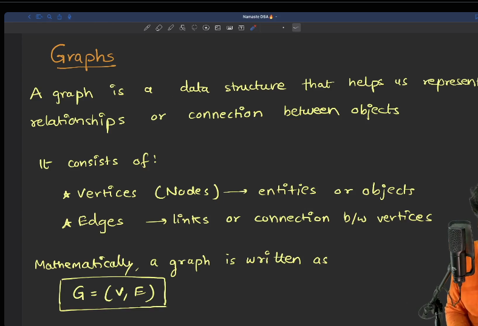
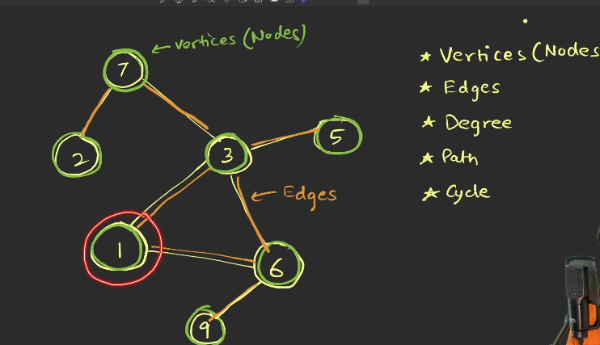
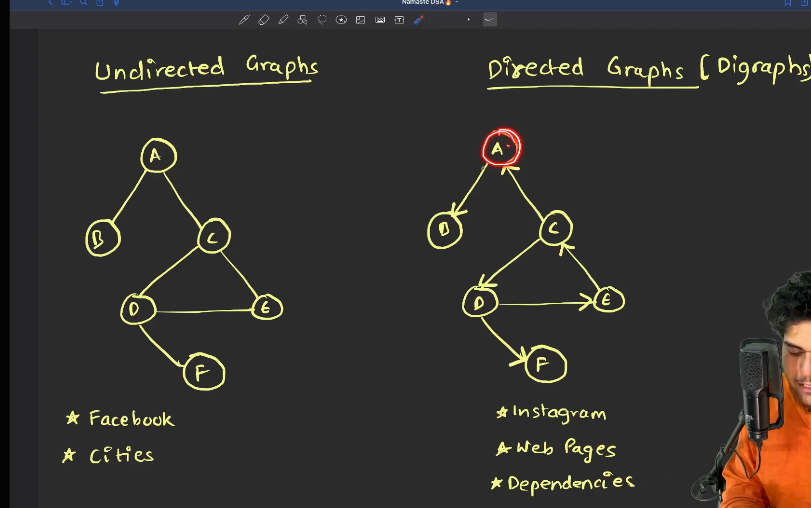
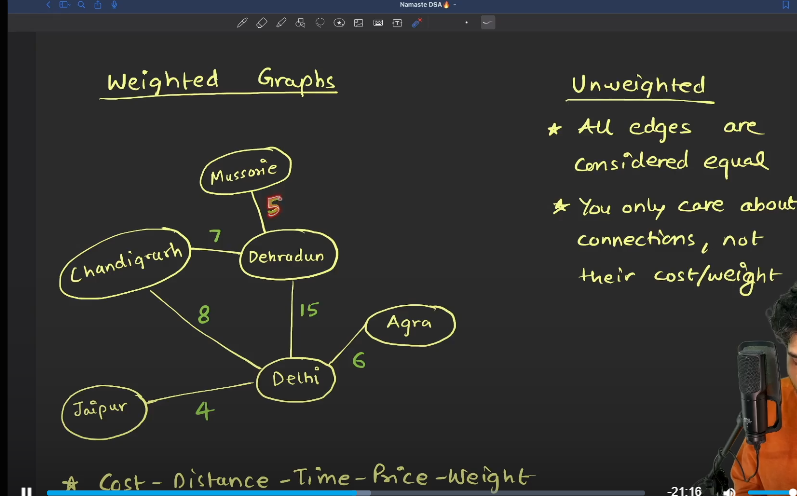
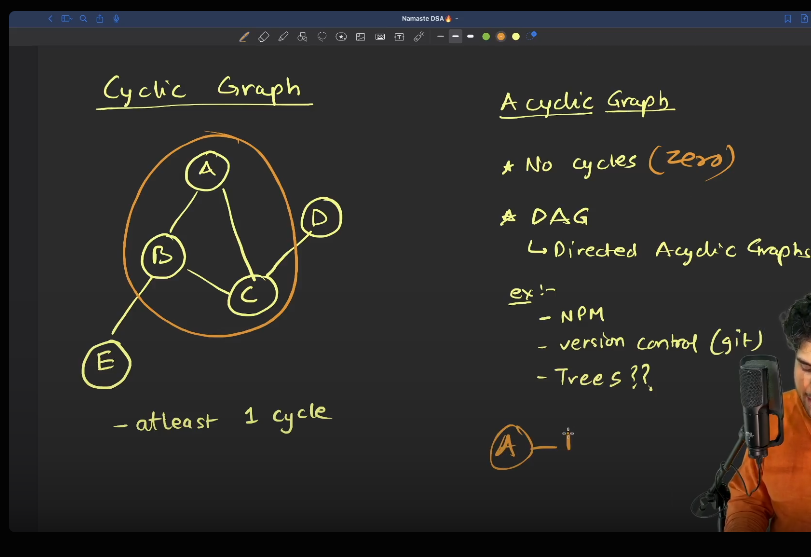
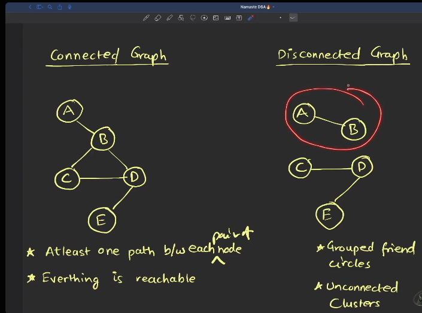
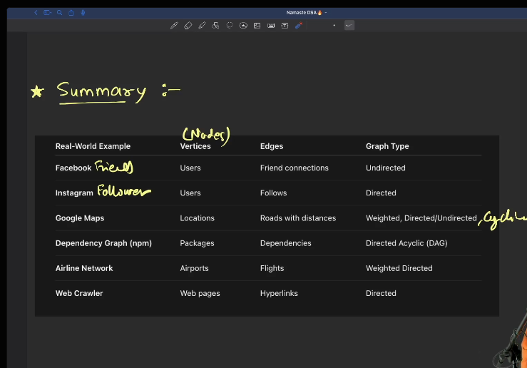

*Vertices : (Nodes) entities or objects
*Edges => Link or connection b/w Vertices

Mathematically We can represent it as 
G = (V, E)
 

 

       ==> Values 
Nodes      
       ==> Edges

One way relationship b/w nodes/vertices

iNDEGREE
outdegree

  

 

