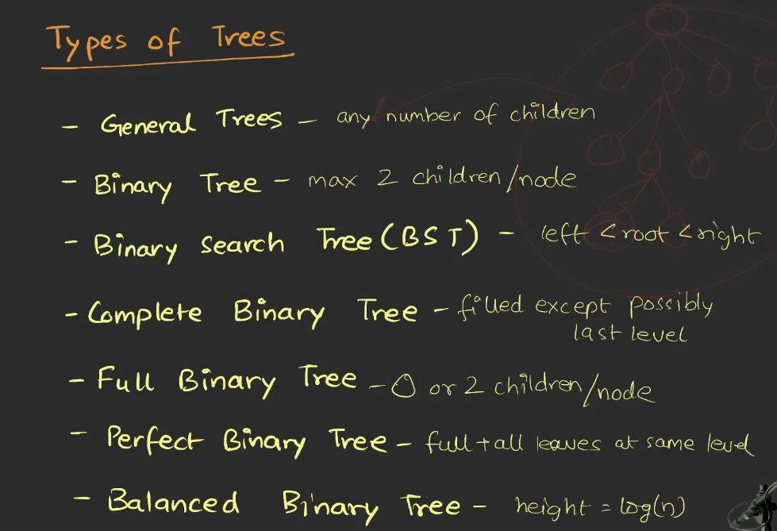
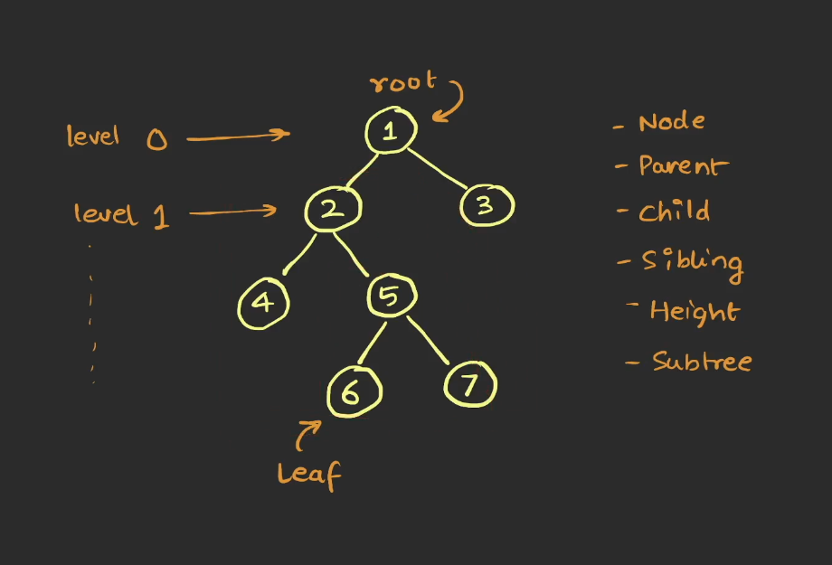
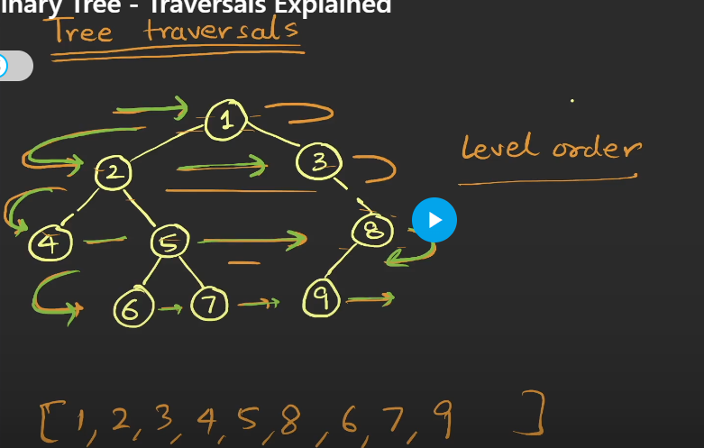

     Tree

    - Non - linear
    - Hierarchial
    Node 
       - zero or more childrem
       - One parent except root

    - cannot have cycles 
    - exactly one path between two nodes
    - No two parents can have same child

    Examples : -

       - File System
       - HTML DOM
       - Databases
       - Hierarchial Data

Root is the starting  point of tree from there we can access every other child

Tree Traversal 

going from one point to another in the tree
-- Preorder Traversal
    root => left = > right

-- Inorder Traversal
Left => Root => Right 
-- Postorder Traversal
  Left => Right => Root 
-- Level Order
  

  